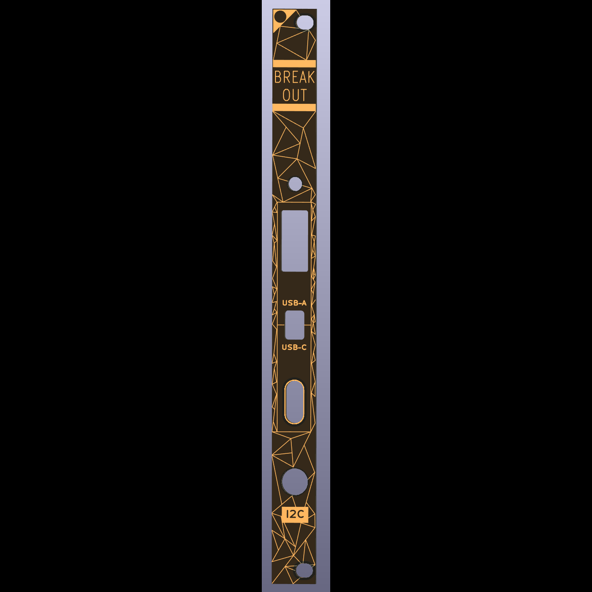

# Breakout

A conduit from the USB on the rear of a module to the face of your modular setup. Breakout has a USB-A port on the rear that is routed to either the USB-A or USB-C port on the front. The rear also has three-pin connector for I2C that is exposed with a mini-TRS socket on the front.

Between you me and the sea, we designed this to accompany several upcoming firmware for [Uncertainty](https://oamodular.org/products/uncertainty) but realized this could be useful for lots of people. Modules like Instruo Lubadh and o_C (most versions) have USB on them that can be brought to the surface of your system.

Breakout is USB 2. USB 3 speeds are not supported.

